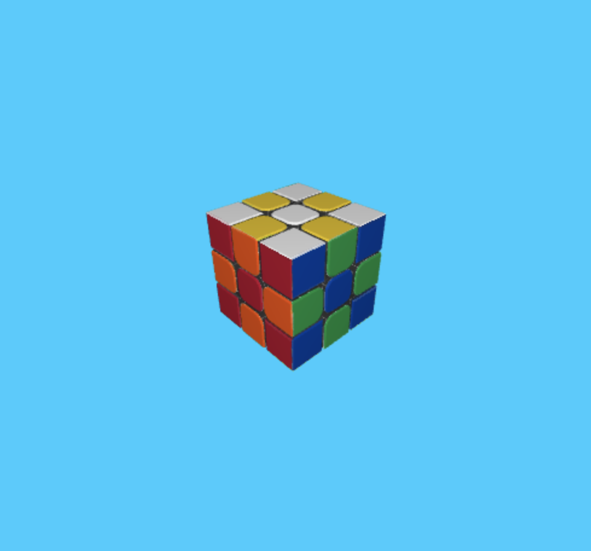

# rubiks-cube-graphics
A 3D rubiks cube game using WebGL.
Uses Blinn-Phong shading for lighting.



Build
===
You can play the game on a browser by serving the static content locally.
You can do this by using python in the project's root directory:

```
python3 -m http.server
```

Then navigate to "localhost:PORT" in a browser.
PORT being whatever port http.server opened on (most likely 8000).
